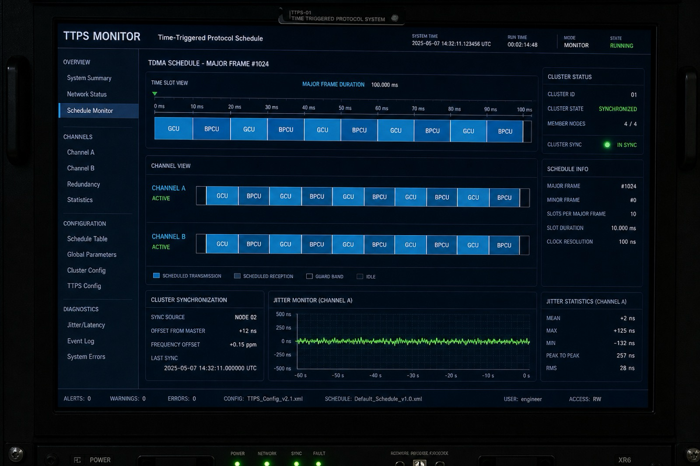

# 基于GCU、BPCU设备的TTP需求测试验证平台

- **Production URL**: [https://26-ttp-test-bid.softwarelink.net/](https://26-ttp-test-bid.softwarelink.net/)
- **Source Code Repository**: [https://github.com/softwarelink-net/26-ttp-test-bid](https://github.com/softwarelink-net/26-ttp-test-bid)



---

## 部署与运行说明

### 环境要求
- Node.js >= 18.0.0
- npm >= 9.0.0
- Wrangler CLI v3+
- Cloudflare D1 / Workers（生产）与 R2 桶 `26-ttp-test-bid-assets`

### 安装依赖
```bash
npm install
```

### 本地开发
```bash
npm run dev
```
浏览器访问 Vite 开发地址（默认 `http://localhost:5173`）。API 由 Cloudflare Vite 插件转发至 Worker；若 D1 离线则自动回落到内存演示数据。

### 演示账号
| 角色 | 账号 | 密码 | 默认路由 |
| :--- | :--- | :--- | :--- |
| Super Admin | `admin` | `admin123` | `/admin/settings` |
| Avionics Test Engineer | `engineer` | `engineer123` | `/dashboard` |
| Auditor / Bid Reviewer | `viewer` | `viewer123` | `/bid-notice` |

### 生产构建与 Cloudflare 部署
```bash
npm run build
wrangler d1 execute Allworld --local --file=./schema.sql
wrangler deploy
```
远程种子（按需）：
```bash
wrangler d1 execute Allworld --remote --file=./schema.sql
```
静态资源同步至 R2：
```bash
npm run deploy
```

### 常用脚本
- `npm run dev`：本地前后端联调
- `npm run build`：生产构建
- `npm run lint`：ESLint
- `npm run db:migrate`：应用 D1 migrations
- `npm run db:seed`：本地执行 `schema.sql`
- `npm run deploy`：构建 + Worker 发布 + R2 上传

### 目录结构
```text
26-ttp-test-bid/
├── src/
│   ├── assets/
│   ├── components/         # StickyTopBanner, TdmaSlotMap, JitterChart, WaveformCanvas
│   ├── layouts/            # AuthLayout, MainLayout
│   ├── router/
│   ├── stores/
│   ├── views/              # BidNotice, Dashboard, Tests, FaultInjection, AdminSettings
│   ├── App.vue
│   └── main.js
├── functions/              # Cloudflare Workers API
│   ├── api/auth|ttp|tests|fault
│   └── [[path]].js
├── worker/index.ts         # allworld 多站点入口 + 本项目主机分流
├── schema.sql              # D1 建表与种子
├── migrations/
├── docs/assets/dashboard-preview.png
├── wrangler.toml
├── index.html
└── package.json
```

---

## 招标公告全文

### 标题
基于GCU、BPCU设备的TTP需求测试验证平台招标公告

### 项目发包方
陕西航空电气有限责任公司

### 项目编号
0730-2611010439/01

### 项目发布时间
2026/08/13 18:01:59

### 关键词
陕西航空电气有限责任公司, TTP需求测试, GCU测试, BPCU设备, TTP总线, 航空电气招标

### 摘要
陕西航空电气有限责任公司采购基于GCU、BPCU设备的TTP需求测试验证平台一套，用于机载电源系统控制器研制及迭代过程中的TTP总线需求测试、同步时序测试及故障注入验证。

### 技术要点
覆盖GCU/BPCU应用层通信、集群规划与调度表、单双网时间同步与恢复、冷启动测试、双余度通信与抖动分析、TDMA物理层信号测试、多场景硬件级故障注入、总线监控与存储、Driver/TD-COM中断时序与运行开销实测。

### 技术创新性
高安全航空嵌入式总线确定性测试、FPGA级纳秒时序捕获、动态ICD/MEDL映射解析与纳秒级Slot可控硬件故障注入。

---

## 免责声明

1. **数据来源与合规性**：本系统展示的所有招标信息、项目背景及采购需求均来源于公开招投标平台（如中国招标投标公共服务平台、中国建设银行龙集采平台等）。系统仅用于技术方案演示、架构原型验证与演示搭建，不涉及任何商业非法抓取或数据篡改。
2. **技术实现路径**：本系统前端基于 Vue 3 + Tailwind CSS 构建，后端基于 Cloudflare Workers 极简无服务器架构，数据存储采用 Cloudflare D1 关系型数据库，完整符合分布式高可用与银企对接安全标准。
3. **保密承诺**：开发团队严格遵守保密义务，系统内示例数据均经过伪化脱敏处理（Anonymized），不包含真实患者医疗健康信息（PHI）或建行敏感金融交易数据。
4. **知识产权与巧合声明**：本系统中涉及的商标、机构名称（中国建设银行、川北医学院附属医院等）归各自合法持有人所有。演示代码与系统架构若与实际投产系统存在相似之处，纯属技术通用设计之巧合。
5. **免责条款**：本演示系统不具备实际金融扣款功能，不承担因非授权使用、不可抗力或第三方平台接口变更所导致的任何法律责任与经济损失。
